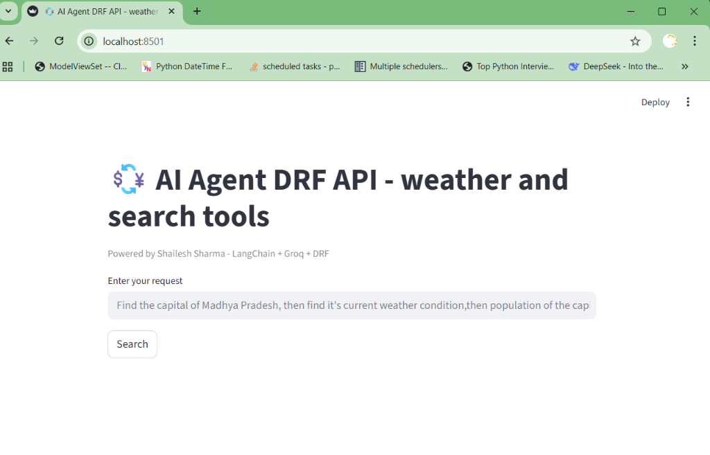
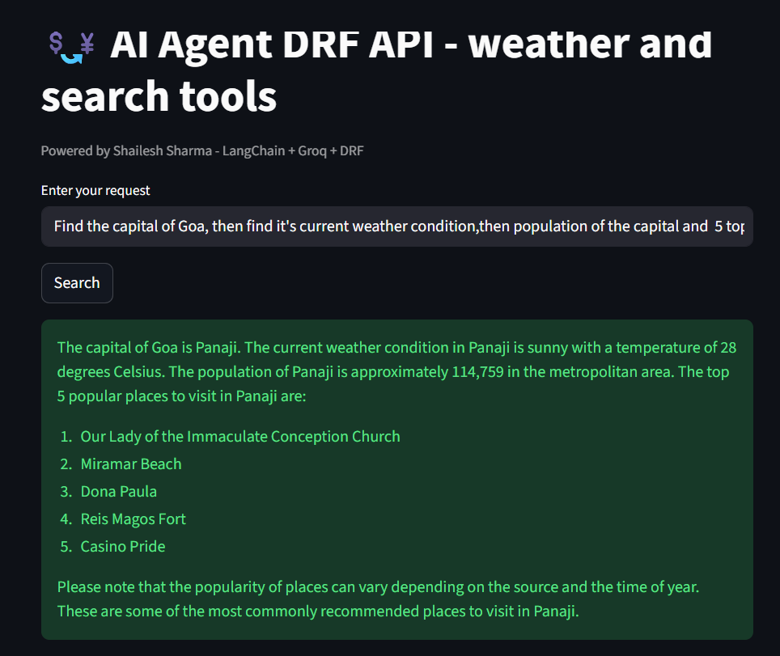
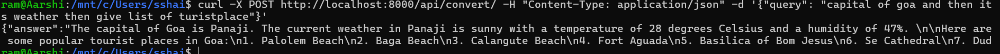

#  AI Agent with DRF & LangChain


A powerful, intelligent AI agent application built with **Django Rest Framework (DRF)**, **LangChain**, and **Groq**. The application features a **Streamlit** frontend for easy interaction and uses the **ReAct (Reasoning + Action)** pattern to intelligently answer user queries by leveraging external tools.

##  Features


- **Intelligent ReAct Agent**: logic that reasons through problems step-by-step.
- **Powered by Groq**: Utilizes the `llama-3.3-70b-versatile` model for high-performance inference.
- **Integrated Tools**:
  - **DuckDuckGo Search**: For retrieving real-time information from the web.
  - **WeatherStack API**: For fetching current weather conditions for any city.
- **Modern Stack**:
  - **Backend**: Django & Django Rest Framework.
  - **Frontend**: Streamlit.
  - **Containerization**: Fully Dockerized for easy deployment.


##  Architecture

The system consists of two main services:
1.  **Backend (Django)**: Exposes a REST API (`/api/convert/`) that accepts a natural language query. It processes this query using the LangChain Agent, which may call external tools (Search/Weather) to formulate an answer.
2.  **Frontend (Streamlit)**: A user-friendly web interface that accepts user input, sends it to the backend, and displays the AI's response.


##  Installation & Setup


1.  **Environment Configuration**
    Create a `.env` file in the root directory and add your Groq API key:
    ```bash
    GROQ_API_KEY=gsk_...
    ```

2.  **Run with Docker Compose**
    Build and start the services:
    ```bash
    docker-compose up --build
    ```

    This will start:
    - **Backend** at `http://localhost:8000`
    - **Frontend** at `http://localhost:8501`

## 🖥️ Usage

### Using the Frontend
1.  Open your browser and navigate to `http://localhost:8501`.
2.  Enter a query in the text box.
    *   *Example:* "Find the capital of France and its current weather."
3.  Click **Search**. The agent will process your request and display the result.




##  Using the API directly
You can interact with the agent via the REST API using `curl` 



 curl -X POST http://localhost:8000/api/convert/      -H "Content-Type: application/json"      -d '{"query": "capital of goa and then its weather then give list of turistplace"}'

**Request Body**:
        ```json
        {
            "query": "What is the price of Bitcoin today?"
        }
        ```


##  Project Structure

        ```
        drf-api-ai-agent/
        ├── backend/                # Django Backend
        │   ├── agent_api/          # App containing Agent logic, Views, and Tools
        │   ├── drfenv/             # Project settings
        │   ├── Dockerfile
        │   └── manage.py
        ├── frontend/               # Streamlit Frontend
        │   ├── app.py              # Main Streamlit application
        │   └── Dockerfile
        ├── docker-compose.yml      # Orchestration for Backend & Frontend
        ├── requirements.txt        # Python dependencies
        ├── .env                    # Environment variables
        └── readme.md               # Project Documentation
        ```

##  Tools Configuration

The agent uses the following tools defined in `backend/agent_api/tools.py`:
- **DuckDuckGoSearchRun**: Built in Tool.
- **WeatherStack**: Custom Tool.


## .env file


        ```
        GROQ_API_KEY1=gsk_GDJGGI
        HUGGINGFACEHUB_API_hJtU
        GROQ_API_KEY=gsk_32Im0
        ```


##############################################################################################################################################################

# Note :  When both your frontend and backend are running in Docker containers, localhost inside the frontend container refers to the frontend container itself, not your backend. You need to connect using the container name or a Docker network alias.


### 1️⃣ Check your backend container name


    
    docker ps


            You might see something like:

            CONTAINER ID   IMAGE                                  NAMES
            a5d2b198c82b   drf-api-ai-agent-backend:latest       currency-backend


          So your backend container name is: currency-backend

### 2️⃣ Use backend container name in frontend requests

    In your frontend code (app.py), change:

    #  Wrong inside Docker
    url = "http://localhost:8000/api/convert/"


      to

#  Correct inside Docker
    url = "http://currency-backend:8000/api/convert/"

### 3️⃣ Make sure both containers are on the same Docker network

   If you run containers separately, create a network:

         docker network create currency-network


Then run backend:

    docker run -d --name currency-backend --network currency-network -p 8000:8000 drf-api-ai-agent-backend:latest


And frontend:

    docker run -d --name currency-frontend --network currency-network -p 8501:8501 drf-api-ai-agent-frontend:latest


Now currency-frontend can reach backend using http://currency-backend:8000.

or 
# use service name in docker-compose.yml 


    "http://backend:8000/api/convert/"  in app.py 

